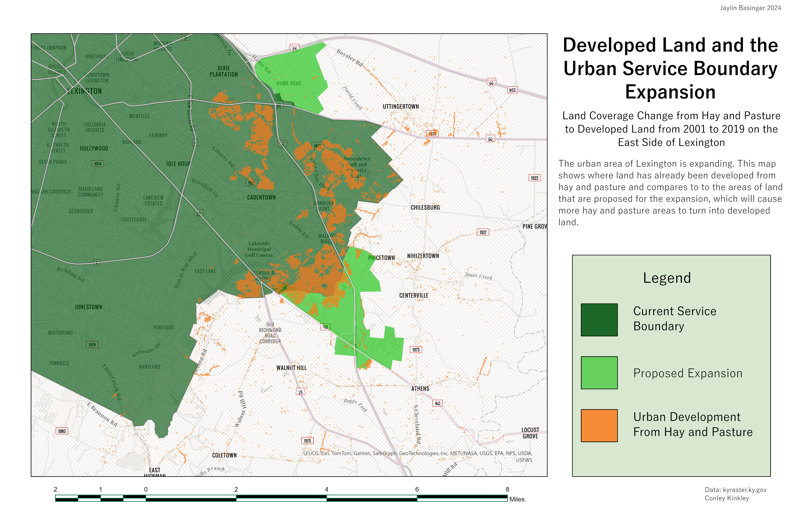

# Developed Land and the Urban Service Boundary Expansion on the East Side of Lexington
## Land Changed From Hay And Pasture to Developed

Map depicting land coverage change on the East side of Lexington from 2001 to 2019 in which hay and pasture lands changed to developed lands, compared to the land proposed for the Urban Service Boundary Expansion

     
*Land Coverage Change and the Urban Service Boundary*

[Link to high-resolution version](Layout1.pdf)     

This created by Jaylin Basinger for GEO 409, Spring of 2024, University of Kentucky, Department of Geography. Data acquired from USGS National Land Coverage Database (https://www.usgs.gov/centers/eros/science/national-land-cover-database) and Conley Kinkhead (https://conleykinkhead.github.io/lexington_urban-service-area/.)  in April, 2024.